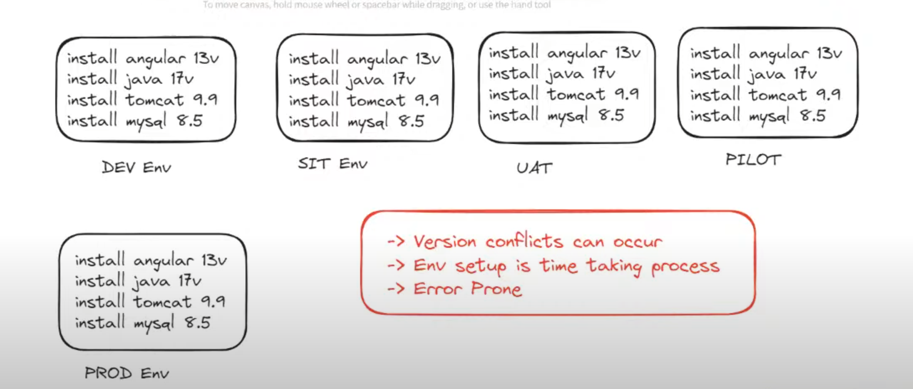
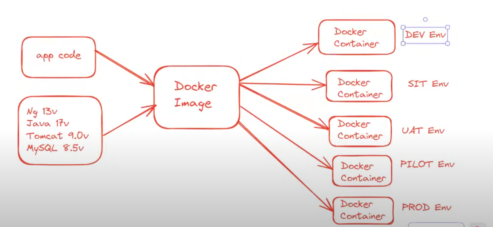
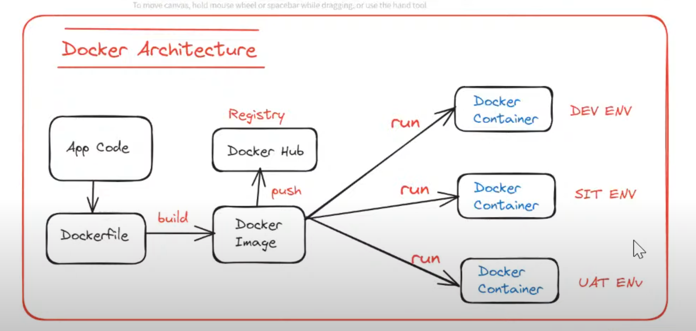
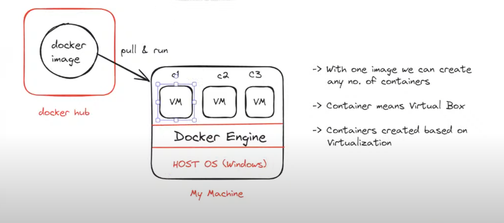

# Application Architecture

When we work on any application, there are 3 main things:

1) **Frontend**: Angular/ReactJS/Vue.js, etc.
2) **Backend**: Java/.NET/Python/PHP
3) **Database**: Oracle, MySQL DB, SQL Server

---

# Application Tech Stack

Suppose we are using the following for the project:

- **Frontend**: ReactJS 18.2.0v
- **Backend**: Java 17v
- **Database**: MySQL 8.5v
- **Tomcat**: 9.0v

---

# Environment Setup To Run Our Application

When we work in an organization, there will be different teams: Development Team, DevOps Team, etc. Now, if the DevOps team needs to deploy the application, they need to set up the environment.

So, to set up and run our application, they will require to do the following steps:

1) Take one machine (Physical / Virtual)
2) Install ReactJS 18.2.0v
3) Install Java 17v
4) Install Tomcat Server 9.0v
5) Install MySQL DB Server 8.5v

So, DevOps need to perform these steps to set up the environment. But in real-time, there will be multiple environments.

---

# Application Environment

1) **Dev**: Developers will use this environment for development purposes.
2) **QA**: The testing team will use this environment for testing the application.
3) **UAT**: Clients or client-side users will use this environment for testing the application.
4) **PILOT**: This is also called the Pre-Production Environment.
5) **PROD**: Live Environment (End users will use this environment).

---

# Challenges in Deployment Process

1) Multiple Environment Setup
2) Setting Up All Required Dependencies (Software) on All Machines
3) Version Conflicts
4) Environment Maintenance
5) Environment Issues

To solve this problem, we need Docker.

---

# Docker

- It is free and open-source software.
- It is used for containerization.
  
Containerization means packaging our "Application Code + Required Dependencies" as a single unit for execution.

There will be application code and dependencies software. We will combine both and create one Docker Image.

If any environment (Dev, QA, UAT, etc.) needs to set up, they will simply pull the Docker Image, and a Docker Container will get created.

So, like this, we don’t need to worry about version conflicts and installation of software.

This concept is called **Containerization**.

If we use Docker in our project, we can run our project on any system without worrying about the underlying software.

---

# Docker Architecture

If we want to understand the working of Docker, then we need to understand the architecture of Docker.

1) **Docker File**

   - It contains a set of instructions to build our Docker image.
   - The Docker file is used to specify what the dependencies are to run our application.

2) **Docker Image**

   - It is the package of code + dependencies.
   - Once our Docker file is created, we will build a Docker Image using the Docker file.

3) **Docker Registry**

   - Once the Docker Image is created, we can store that Docker Image in Docker Hub / Docker Registry.
   - This is also called a push operation.
   - We can store the Docker image in different repositories like Nexus repository, JFrog repository, AWS ECR, etc.

4) **Docker Container**

   - Once the Docker Image is created, we can pull/run the Docker image on any system.
   - When we pull/run the Docker image, it creates a Docker container on our system.

---

**NOTE:**  
If tomorrow we want to change the version of Java from Java 17v to Java 21v, then we can make changes in the app code and Docker file and create a new Docker image of that application.  
We don’t need to make changes in every environment.  
That’s the beauty of Docker.

We also need to install Docker on the system. If there are 10 systems, we need to install Docker on each system.  
We just need to follow a few steps:
- Install Docker
- Pull the Docker Image
- Download the Docker Image
- Run the Docker Image

In the above image, we can see that we have our own machine (i.e., system).  
In that machine, we have Windows OS.  
And we just need to install Docker Software (also known as Docker Engine).  
Once that's done, we need to pull and run Docker Images available in Docker Hub.  
Once we pull the Docker Image, it will create a Virtual Machine (also known as a Docker Container).  
If we pull multiple Docker Images, multiple Virtual Machines will get created.  
Containers are created based on virtualization.  
So, we don’t need to install any software on the host machine because Docker will take care of that in the Virtual Machine.

